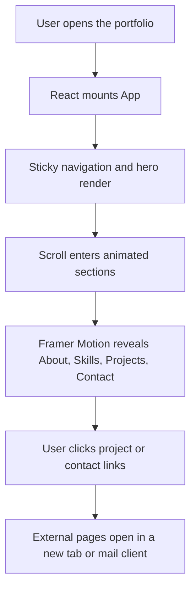
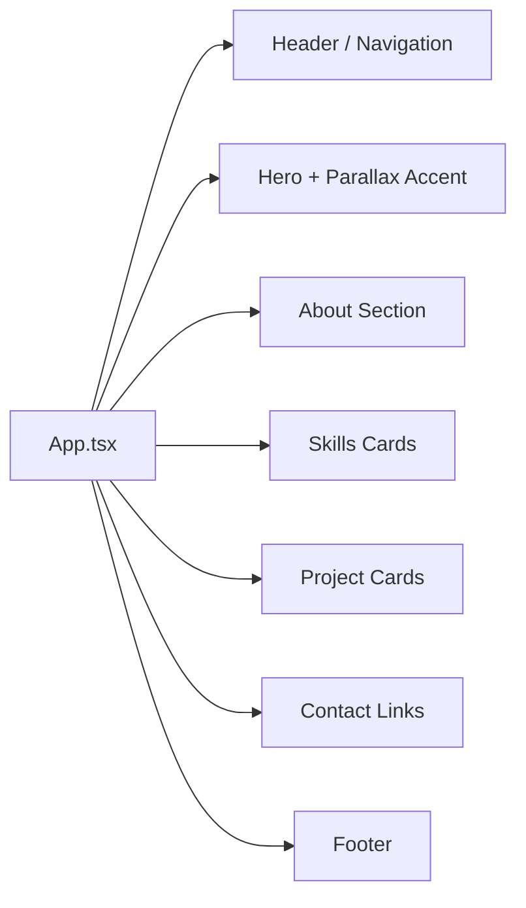

# Rama Lokesh Reddy Penumallu Portfolio

<p align="center">
	
</p>

## Overview

This repository contains a responsive, animated personal portfolio website built from scratch to showcase projects, skills, background, and contact information in a polished, modern layout. The site is intentionally lightweight, visually expressive, and optimized for fast iteration with clean component-based structure.

Live site: https://prlr-profile.vercel.app/

## Tech Stack

- React 19
- Vite 8
- TypeScript 6
- Framer Motion
- Lucide React
- Plain CSS
- Google Fonts

## Highlights

- Sticky responsive navigation with a mobile menu
- Hero, About, Skills, Projects, Contact, and Footer sections
- One parallax-style hero accent driven by scroll progress
- Three+ on-scroll motion sequences using Framer Motion
- Reduced-motion support via a global CSS media query
- External project and profile links for real-world credibility

## Execution Flow



## Component Flow



## Code Structure

```text
.
├── README.md
├── architecture.md
├── projectdocumentation.md
├── answers.md
├── index.html
├── package.json
├── public/
├── src/
│   ├── App.tsx
│   ├── App.css
│   ├── index.css
│   ├── main.tsx
│   └── assets/
└── vite.config.ts
```

## Local Setup

### Prerequisites

- Node.js 18 or newer
- npm 9 or newer

### Installation

```bash
git clone https://github.com/ramalokeshreddyp/Reddy-devcanvas.git
cd Reddy-devcanvas
npm install
```

### Run Locally

```bash
npm run dev
```

### Validate

```bash
npm run build
npm run lint
```

### Preview Production Build

```bash
npm run build
npm run preview
```

## Workflow Summary

1. Plan the section order and content.
2. Build the structure in React components.
3. Apply responsive styling and typography.
4. Add motion, parallax, and scroll reveals.
5. Validate build, lint, and responsive behavior.
6. Push to GitHub and deploy to a live host.

## Notes

- The site is frontend-only by design; there is no backend or database layer in this portfolio.
- All motion is constrained to transform and opacity for smoother performance.
- The design uses custom CSS rather than a UI component library so the visual language stays fully personal and consistent.
