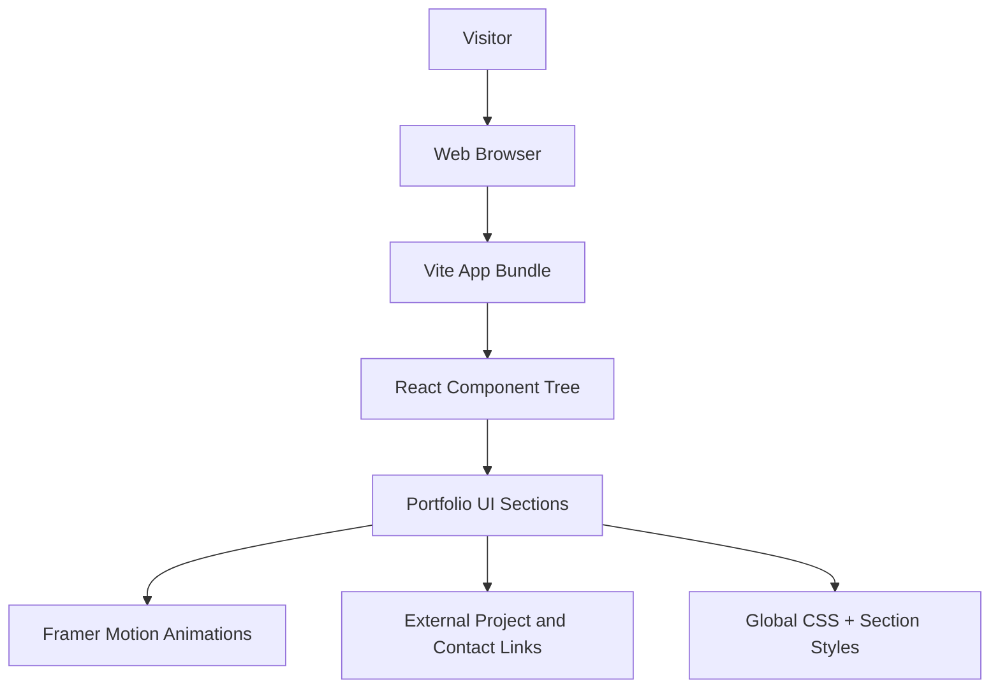
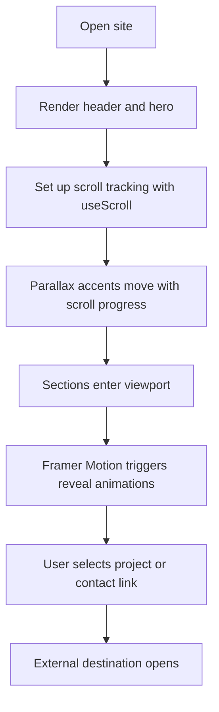
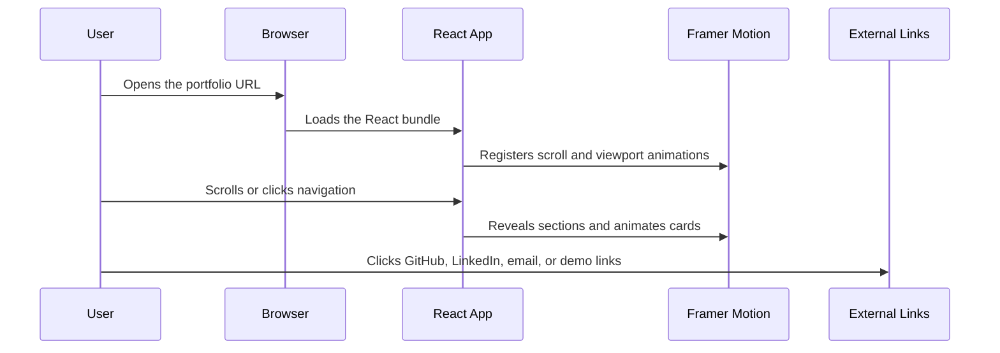

# Architecture Documentation

## 1. Main Idea

This project is a personal portfolio website designed to present the developer's identity, skills, and selected work in a polished, modern, and responsive format. The focus is on clarity, strong hierarchy, subtle motion, and a lightweight implementation that performs well on mobile and desktop.

The application is intentionally frontend-only. It does not require a backend service or database because the content is static, presentation-focused, and composed of personal profile data, project links, and contact links.

## 2. System Architecture



### Architecture Summary

- The browser loads the Vite-generated bundle.
- React renders the application as a single-page experience.
- CSS handles the visual system, layout, typography, and responsiveness.
- Framer Motion provides scroll-triggered reveals and parallax-linked hero accents.
- External links point to GitHub, LinkedIn, email, and live demos.

## 3. Folder Organization

```text
.
├── index.html                # HTML shell with meta tags and root mount point
├── package.json              # Scripts and dependency manifest
├── public/                   # Static assets served as-is
├── src/
│   ├── main.tsx              # React entry point
│   ├── App.tsx               # Main page composition and content data
│   ├── App.css               # Section styles, layout, and responsive design
│   ├── index.css             # Global styles, fonts, and motion preferences
│   └── assets/               # Local project assets
├── README.md                 # Submission-friendly overview and setup guide
├── architecture.md           # Technical architecture deep dive
└── projectdocumentation.md   # Full project documentation and process notes
```

## 4. Module Responsibilities

### `src/main.tsx`

- Boots the React application.
- Imports the global stylesheet.
- Mounts the `App` component into the root DOM node.

### `src/App.tsx`

- Defines the portfolio content model.
- Renders the navigation, hero, about, skills, projects, contact, and footer sections.
- Applies Framer Motion variants and viewport-based animations.
- Handles the mobile navigation toggle.

### `src/App.css`

- Contains the custom layout system and component styling.
- Implements responsive breakpoints for mobile, tablet, and desktop.
- Styles cards, buttons, hero blocks, and section grids.

### `src/index.css`

- Sets theme variables and global document behavior.
- Imports Google Fonts.
- Defines the reduced-motion accessibility rule.

## 5. Key Design Decisions

### Why React + Vite

- Fast startup and rebuilds during development.
- Clean component-based composition for a small portfolio.
- Minimal overhead compared with a full backend framework.

### Why Plain CSS

- The design needed custom gradients, glass effects, and careful spacing control.
- Plain CSS avoided another abstraction layer and kept the visual language easy to tune.
- The file structure remains easy to audit and straightforward to maintain.

### Why Framer Motion

- It integrates naturally with React.
- It provides viewport-aware variants and simple declarative transitions.
- It supports staggered reveals and scroll-linked effects with low implementation complexity.

## 6. Workflow and Execution Flow



## 7. Data Flow



## 8. Animation Strategy

- Hero copy animates in on first paint.
- About, Skills, Projects, and Contact animate when they enter the viewport.
- Project cards and skill bars reveal with staggered motion.
- Decorative hero elements follow scroll progress to simulate depth.
- Motion respects the reduced-motion media query.

## 9. Performance Approach

- Animate only transform and opacity.
- Keep the page single-route and dependency-light.
- Use CSS gradients and vector icons instead of large image dependencies.
- Avoid unnecessary re-renders by keeping content data in simple arrays.

## 10. Advantages

- Fast development and fast production builds.
- Clear, readable component structure.
- Easy to update content or add sections.
- Strong responsiveness and smooth motion.

## 11. Tradeoffs

- No backend or database layer is required, so the app is less suitable for dynamic content management.
- Using plain CSS instead of a utility framework means more custom styling work up front.
- Motion and layout are handcrafted, so future scale would require careful style organization.

## 12. Integration Details

- `App.tsx` feeds section data directly into the UI.
- `App.css` and `index.css` jointly define the visual system.
- `index.html` provides the meta description, viewport, and title for SEO.
- External links connect the portfolio to real project repositories and profile pages.

## 13. Validation Strategy

The project was validated with:

- `npm run build`
- `npm run lint`
- Visual checks across mobile, tablet, and desktop widths
- Manual inspection of motion behavior and reduced-motion support

## 14. Scope Note

This project is a frontend portfolio by design. A backend or database is not part of the current architecture because the site content is static and the submission requirements are focused on presentation, responsiveness, motion, and deployment.