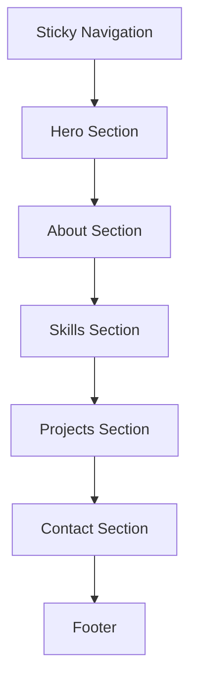
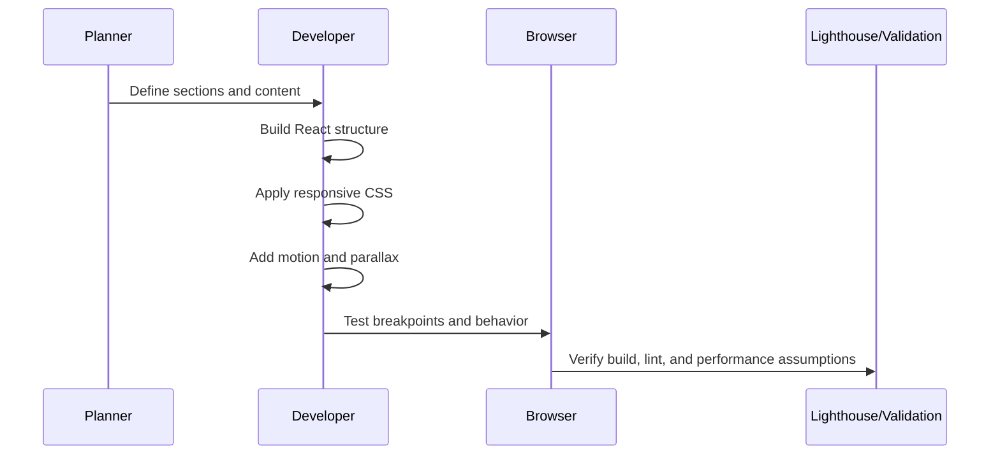
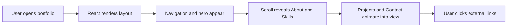
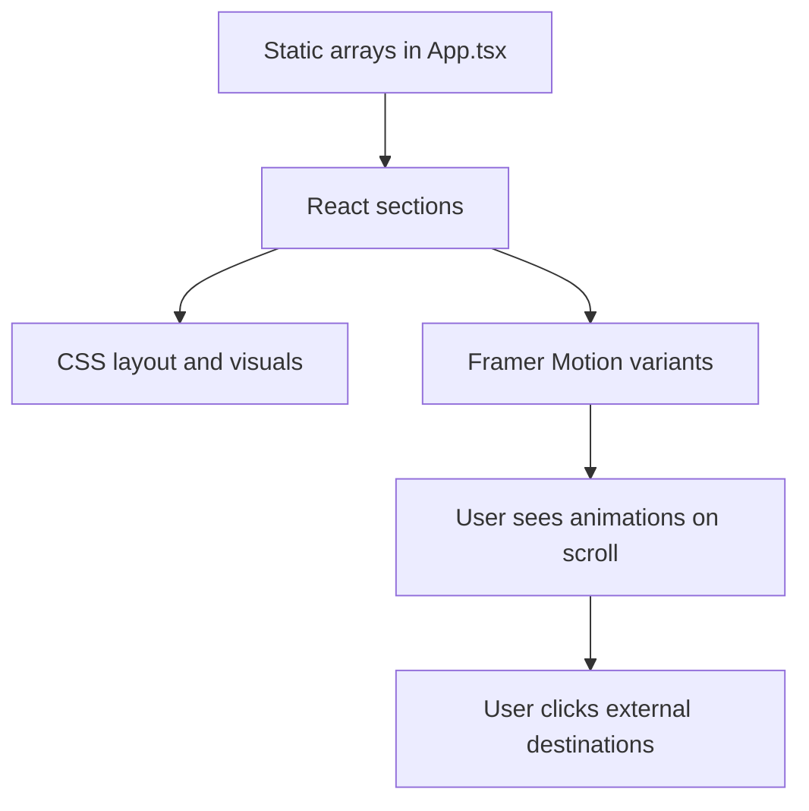

# Project Documentation

## 1. Project Objective

The objective of this project is to deliver a personal portfolio website that feels modern, responsive, animated, and professional. The site should communicate the developer's identity, background, technical strengths, and project experience in a way that is visually memorable while remaining easy to use.

## 2. What the Project Includes

- A sticky responsive navigation bar
- Hero, About, Skills, Projects, Contact, and Footer sections
- A parallax-style hero accent tied to scroll progress
- Three or more viewport-triggered animations
- External links for email, GitHub, LinkedIn, and live demos
- A reduced-motion accessibility fallback

## 3. Visual Direction

The visual system uses a dark editorial palette, soft glow gradients, glass-like panels, and expressive typography. The goal is to balance technical credibility with a more personalized and refined feel.

### Design Principles

- Strong hierarchy and readable spacing
- Minimal but purposeful motion
- High contrast between text and background
- Consistent component styling across sections
- Mobile-first responsiveness

## 4. Wireframe Translation



### Section Layout Logic

- Hero: split layout on desktop, stacked on mobile
- About: avatar on one side, narrative text on the other
- Skills: three-card grid with visual progress bars
- Projects: three-card grid with descriptions and links
- Contact: card-based link cluster for quick action

## 5. Component Responsibilities

### Navigation

- Provides quick anchors to all sections.
- Collapses into a mobile toggle for smaller screens.
- Keeps navigation accessible and responsive.

### Hero

- Introduces the name, title, and value proposition.
- Displays headline stats and a visual avatar panel.
- Contains the parallax decorative elements.

### About

- Describes the background and current focus areas.
- Reinforces the personal brand and skill direction.

### Skills

- Shows skills as structured cards rather than plain text.
- Uses progress bars to give visual weight to each capability group.

### Projects

- Presents three real projects with descriptions, stacks, and links.
- Prioritizes clear project summaries and action links.

### Contact

- Offers direct mailto, GitHub, LinkedIn, and live portfolio links.
- Makes it easy for a recruiter or collaborator to respond quickly.

## 6. Tech Stack and Why It Was Chosen

### React

- Component-driven architecture
- Easy section reuse
- Strong fit for interactive portfolios

### Vite

- Fast local development
- Fast production builds
- Minimal tooling overhead

### TypeScript

- Adds type safety to component props and content data
- Helps keep the codebase maintainable

### Framer Motion

- Declarative scroll-triggered animations
- Smooth and lightweight visual motion
- Simple integration with React components

### Lucide React

- Clean, consistent SVG icons
- Lightweight and easy to style

### CSS

- Full control over layout and visual identity
- No need for a separate UI framework abstraction

## 7. Workflow Explanation



## 8. Execution Flow



## 9. Problem-Solving Approach

The project was approached in small, testable slices:

1. Scaffold the app and establish the content model.
2. Build the sections without motion first.
3. Add responsive styling and verify breakpoints.
4. Add Framer Motion reveals and parallax.
5. Validate build output and lint results.
6. Replace generic copy with real profile data.
7. Document the work clearly for submission.

## 10. Data Flow

This site has no backend API or database. The data flow is therefore presentation-driven:



## 11. Key Modules and Their Responsibilities

| Module | Responsibility |
| --- | --- |
| `src/main.tsx` | Entry point that mounts React into the DOM |
| `src/App.tsx` | Main page composition, content arrays, and motion hooks |
| `src/App.css` | Component-level layout, cards, and responsive styling |
| `src/index.css` | Global variables, fonts, and accessibility motion rules |
| `index.html` | SEO metadata and root container |

## 12. Pros and Cons

### Pros

- Fast to understand and maintain
- Clean single-page structure
- Good performance characteristics
- Strong visual polish with a limited toolset

### Cons

- No CMS or backend for dynamic content updates
- Styling is custom, so future changes require direct CSS edits
- Motion must be carefully managed to avoid overuse

## 13. Integration Details

- The portfolio is a single React application.
- All content is hardcoded in arrays to keep the implementation predictable.
- External project links and contact links connect the site to the broader web presence.
- The Google Fonts import establishes the display/body typography pairing.

## 14. Testing Strategy

Validation was performed with the following checks:

- Production build: `npm run build`
- Linting: `npm run lint`
- Manual responsive checks at mobile, tablet, and desktop widths
- Motion review with attention to reduced-motion behavior

## 15. Setup and Execution

### Install

```bash
npm install
```

### Run in Development

```bash
npm run dev
```

### Build for Production

```bash
npm run build
```

### Preview the Production Build

```bash
npm run preview
```

## 16. Current Scope

This project intentionally stays frontend-only. That choice keeps the architecture smaller, faster to review, and aligned with the submission goal of producing a polished portfolio website rather than a full-stack product with persistent data.

## 17. Final Outcome

The result is a clean, modern, responsive portfolio that is easy to navigate, visually distinctive, and technically straightforward to maintain. The documentation files in this repository are designed to make the project presentation-ready for review, submission, or future extension.